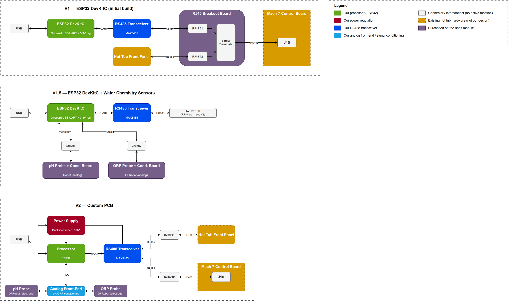
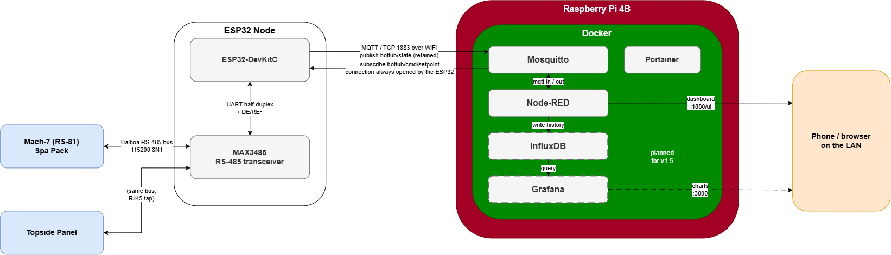

# Hot Tub Remote Controller

[](https://github.com/nmbarr/hottub_remote_controller/actions/workflows/ci.yml)

Hardware and firmware for a remote monitor/controller that taps into a hot
tub's control system, aiming to expose status and control over WiFi instead
of only via the tub's built-in panel.

## Status

Early hardware design phase, **currently mid-pivot**. The tub's topside is a
Balboa VL240, and on GS-series packs that panel is not on an RS485 bus at
all: it is a dumb terminal on a 6-signal harness — four raw button contacts
plus a clock/data pair carrying the 7-segment display bitmap. See
[`docs/wifi.md`](docs/wifi.md#topside-panel-interface).

That invalidated the RS485 design this repo was originally built around.
Superseded and removed:

- `firmware/v1` — the from-scratch UART2 half-duplex driver, `0x7e` framer,
  and Balboa CRC-8. None of it described this tub, and it's been replaced
  by `firmware/esphome-spa`: a vendored, adapted fork of
  [kgstorm/Balboa-GS100-with-VL260-topside](https://github.com/kgstorm/Balboa-GS100-with-VL260-topside)
  (see [`firmware/esphome-spa/README.md`](firmware/esphome-spa/README.md)),
  which already implements the display-tap decode this tub's interface
  needs.
- The MAX3485 in `hardware/esp32-spa` (renamed from `hardware/v1`), and V2's
  plan to interpose between panel and pack. The board no longer sits *in*
  the harness; it hangs off it in parallel.

Still true: the ESP32 DevKitC, the RJ45 breakout so nothing gets spliced,
and the V2 antenna work. `firmware/esphome-spa` talks to Home Assistant
(running on the same Pi) rather than MQTT/Node-RED directly — see its own
README — though Mosquitto/Node-RED may still end up in the picture for
anything without an HA integration, like the planned pH/ORP sensors.

Nothing has been connected to the tub yet. The interface above is confirmed
for kgstorm's GS100; this pack is a Mach 7 (RS-81), and matching it is still
an inference from parts listings — see the read-only check in
[`docs/wifi.md`](docs/wifi.md#still-unconfirmed) before building.

## Hardware

`hardware/esp32-spa` (renamed from `hardware/v1`) contains the KiCad project
for the v1 board:

- **ESP32-DevKitC** as the main controller.
- **MAX3485** RS485 transceiver — **superseded**, see Status. The schematic
  has not been redrawn yet.

What replaces it: a passive tap on the topside harness. Two divided inputs
for the display clock and data, and four optocouplers to bridge the button
contacts without loading or backfeeding the panel, which stays wired in
parallel and has to keep working.

### Hardware diagram



The three planned board revisions (v1, v1.5, v2 — see the roadmap below).

### Hardware roadmap

The hardware diagram lays out three planned revisions:

- **V1 — ESP32 DevKitC (initial build).** An ESP32 DevKitC (using its
  onboard USB-UART and 3.3V regulator) tapping the topside harness between
  the front panel and the Mach-7 control board, through an off-the-shelf
  RJ45 breakout board and screw terminals — no cutting or splicing of the
  existing harness. Two resistor-divided inputs read the display clock and
  data; four optocouplers bridge the button contacts. Build the read-only
  half first: it needs no optocouplers and touches nothing the pack can act
  on, so it proves the interface before anything can press a button.
- **V1.5 — + water chemistry sensors.** Same V1 hardware and same tap,
  with off-the-shelf DFRobot pH and ORP probes (each with its own analog
  conditioning board) added on, wired into the DevKitC's analog inputs via
  Gravity/JST connectors.
- **V2 — custom PCB.** Replaces the DevKitC with a purpose-built board: an
  ESP32-WROOM-32UE as the processor, a dedicated buck-converter power
  supply, and the dividers and optocouplers onboard. Note this no longer
  needs two RJ45 jacks in series: the board is a parallel tap, not an
  interposer, so one jack on a splitter off the existing harness does the
  job and keeps the panel working if the board is unplugged. The purchased
  DFRobot conditioning boards are also replaced by a custom analog front-end
  that conditions the raw pH and ORP electrodes directly for the ESP32's
  ADC.

#### Antenna

V2 uses the **WROOM-32UE**, the variant with a U.FL connector for an
external antenna, rather than the **-32E** with its PCB trace antenna.
Everything about the two is identical except the antenna, and the deciding
factor is where the board lives: a spa equipment bay is water on all sides,
several inches of foam insulation, a sealed enclosure the board cannot work
without, and an AP that is inside the house through at least one exterior
wall.

Marginal WiFi is a worse outcome here than it looks. The whole design
depends on the ESP32 holding an outbound MQTT connection, so a weak link
does not degrade gracefully — it becomes a board that drops and reconnects,
with `hottub/status` flapping through its LWT. Diagnosing that once the
board is sealed into a box under the tub is miserable.

The decision does not have to be made at layout time. Both modules share a
pad layout — the -32UE is simply shorter, having no antenna section — so a
footprint drawn for the -32E, with the module at the board edge and its
antenna keepout honoured, accepts either. Note that the keepout is a hard
constraint that shapes the board outline (no copper, no pour, no traces on
any layer); getting it wrong detunes the antenna, which presents exactly
like weak WiFi and cannot be fixed without a respin.

For the antenna itself: 2.4GHz only, since that is all the ESP32 speaks,
and a **2–3 dBi omni dipole** rather than something advertising high gain.
Omni antennas buy gain by flattening their pattern into a disc, which
trades away the vertical coverage that matters when the geometry is not
known in advance.

Keep the U.FL pigtail short, 100–150mm. Pigtail coax runs about 1.5 dB/m at
2.4GHz, so a long one gives back more than the antenna gains; use RG316 if
the antenna genuinely needs to be further away. Buy pigtail and antenna as
a matched pair — RP-SMA and SMA are a reversed-gender convention, look
nearly identical, and are easy to mix up.

Placement matters more than any of this. Getting the antenna out of the
foam and outside the enclosure is worth more than an antenna upgrade, and
the bulkhead that gets it there is a hole in a sealed box in a splash zone:
use an IP-rated one with an O-ring, on a face that does not collect drips.

Worth measuring rather than guessing — `esp_wifi_sta_get_ap_info()` reports
RSSI, so candidate placements can be compared directly before anything is
sealed up. Better than −65 dBm is comfortable; worse than −80 is the
reconnect-loop failure mode above.

## IoT architecture diagram



The runtime topology: the parallel tap on the harness between the topside
panel and the Mach-7 pack, and the ESP32's Home Assistant API link on the
Pi. Mosquitto/Node-RED are sketched as planned rather than wired up — the
v1.5 chemistry sensors don't have a Home Assistant-native path the way the
panel decode does via `firmware/esphome-spa`, so they may end up going
through MQTT/Node-RED instead once they exist.

## Docs

- [`docs/wifi.md`](docs/wifi.md) — the topside panel interface (connector
  pinout, signal levels, frame format), plus the plan for exposing the tub
  over WiFi via MQTT to a Raspberry Pi running Mosquitto and Node-RED: a v1
  that monitors and controls the tub from the local network, and a v2 that
  adds remote access over a VPN (no firmware change). **Stale on the MQTT
  point** — see `firmware/esphome-spa`'s README for the Home Assistant path
  this device actually takes; the panel-interface reverse-engineering
  (pinout, signal levels, frame format) is unaffected.
- [`docs/wsl-setup.md`](docs/wsl-setup.md) — building and flashing from WSL2:
  forwarding the DevKitC's USB serial port in with usbipd-win, `dialout`
  permissions, and activating this machine's `eim`-installed ESP-IDF.

## Repository layout

```
hardware/esp32-spa/    KiCad schematic and project for the v1 board
firmware/esphome-spa/  ESPHome firmware (fork of kgstorm's), Home Assistant-controlled
Drivers/libdrivers     Submodule of shared, vendor-agnostic sensor drivers
docs/                  Hardware and IoT architecture diagrams and design notes
```

## Firmware

`firmware/esphome-spa` is an ESPHome project — see
[`firmware/esphome-spa/README.md`](firmware/esphome-spa/README.md) for
provenance, build, and Home Assistant setup:

```
pip install esphome
esphome run firmware/esphome-spa/esp32-spa.yaml   # first flash, over USB
```

Target wiring for the topside tap. The panel harness is an 8-pin RJ45; pin
numbering and the signals on it are documented in
[`docs/wifi.md`](docs/wifi.md#connector).

| RJ45 pin | Signal | ESP32 | Via |
| ---: | --- | --- | --- |
| 1 | +5V | `VIN` | measure before connecting |
| 4 | GND | `GND` | — |
| 6 | Clock | GPIO35 | divider, 220Ω series |
| 5 | Display data | GPIO34 | divider |
| 2 | Warm | GPIO25 | optocoupler |
| 8 | Cool | GPIO26 | optocoupler |
| 3 | Light | GPIO27 | optocoupler |
| 7 | Jets/blower | GPIO32 | optocoupler |

Clock and data go on GPIO34/35 because those are input-only, which is the
property you want on the two pins wired to a live panel the firmware must
never drive. They have no internal pull-ups, so pull externally.

The signals are 5V. Divide them: 6.8k/10k lands at 2.98V, with headroom
under the ESP32's 3.6V absolute maximum even if the pack's rail sits high.
Buttons go through a PC817B each, 220Ω on the LED, collector to +5V and
emitter to the button line — wiring and the reasoning behind the values are
in [`docs/wifi.md`](docs/wifi.md#button-injection).

If you're developing in WSL2, the board is attached to Windows and its
serial port has to be forwarded in before `esphome` can see it — see
[`docs/wsl-setup.md`](docs/wsl-setup.md).

## Submodules

This repo uses a git submodule for shared drivers:

```
git submodule update --init --recursive
```

## CI

The `CI` workflow (`.github/workflows/ci.yml`) runs on every PR, on pushes to
`main`, and weekly against `main` (Mondays) to catch drift even when
nothing's changed recently. The split matters: `pull_request` covers proposed
changes and fork PRs, `push` covers what actually lands, and leaving both
unrestricted ran every job twice on the same commit.

A second push to a branch supersedes its in-flight run rather than letting it
finish against a commit nobody is waiting for. `main` is exempt, so each
landed commit keeps a result of its own.

`hardware` runs KiCad's headless checks: ERC on each project's schematic, and
DRC on its board once one exists (v1 and v1.5 are schematic/wiring-only, no
custom PCB — that starts with v2).

`esphome-build` compiles `firmware/esphome-spa/esp32-spa.yaml`, installing
ESPHome fresh each run (its ESP-IDF download is cached across runs) and
supplying the committed `secrets.yaml.example` in place of the gitignored
real `secrets.yaml`; it holds no real secrets and never reaches a board from
CI. This is what catches a vendored-component compile break against a newer
ESPHome release, same as it caught the missing `text_sensor.h` include
upstream needed.

`esphome-build` is the only job gated on what changed: a `changes` job
reports whether `firmware/esphome-spa/**` (or the workflow itself) was
touched, and the build is skipped otherwise. The gate is on the job, never on
the workflow's triggers — see below.

`hardware` is a required status check on `main`, which is why no job has a
paths filter — a required check skipped by a path filter never reports at
all, and GitHub blocks the merge on it forever. Skipping a job with `if:` is
different and safe: the workflow still triggers and the job still reports,
just with a skipped conclusion, which branch protection accepts. That is why
`esphome-build` is gated that way rather than with a paths filter.

A status check's identity comes from the job name, not the workflow file name,
so renaming the file from `kicad-checks.yml` left the required check intact.

The `hardware` job seeds KiCad's default global library tables before running so stock
libraries resolve the same as on a normal install; only error-severity
findings fail the build, and remaining warnings (currently just
`PCM_Espressif`, a library installed locally via KiCad's Plugin & Content
Manager rather than vendored into the repo) print to the log for visibility
but don't block.
