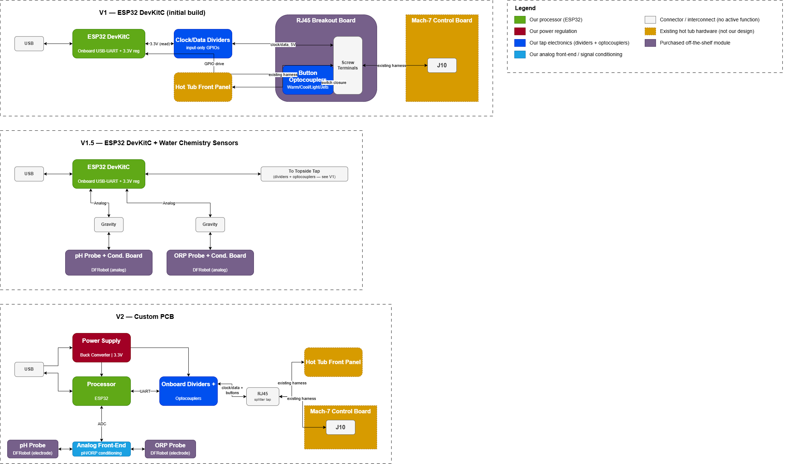
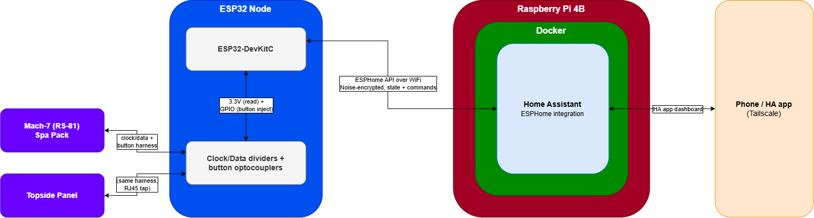

# Hot Tub Remote Controller

[](https://github.com/nmbarr/hottub_remote_controller/actions/workflows/ci.yml)

Hardware and firmware for a remote monitor/controller that taps into a hot
tub's control system, exposing status and control over WiFi in addition to
the tub's built-in panel.

## Status

Early hardware design phase. Nothing is connected to the tub yet.

The board is a passive tap on the topside harness, not an interposer: it
hangs off the harness in parallel rather than sitting between panel and
pack. Two divided inputs read the display clock and data; four
optocouplers bridge the button contacts without loading or backfeeding the
panel, which stays wired in parallel and keeps working regardless.

`firmware/esphome-spa` is a vendored, adapted fork of
[kgstorm/Balboa-GS100-with-VL260-topside](https://github.com/kgstorm/Balboa-GS100-with-VL260-topside)
(see [`firmware/esphome-spa/README.md`](firmware/esphome-spa/README.md)),
which implements the display-tap decode this tub's interface needs. It
talks to Home Assistant (running on the same Pi) rather than MQTT/Node-RED
directly — see its own README — though Mosquitto/Node-RED may still get
used for anything without an HA integration, like the planned pH/ORP
sensors.

## Hardware

`hardware/esp32-spa` contains the KiCad project.

- **ESP32-DevKitC** as the main controller.
- Two resistor-divided inputs for the display clock and data.
- Four optocouplers to bridge the button contacts.

### Hardware diagram



Three planned board revisions (v1, v1.5, v2), described below.

### Hardware roadmap

- **V1 — ESP32 DevKitC.** An ESP32 DevKitC (using its onboard USB-UART and
  3.3V regulator) taps the topside harness between the front panel and the
  Mach-7 control board, through an off-the-shelf RJ45 breakout board and
  screw terminals — no cutting or splicing of the existing harness. Two
  resistor-divided inputs read the display clock and data; four
  optocouplers bridge the button contacts. The read-only half comes first:
  it needs no optocouplers and touches nothing the pack can act on, so it
  proves the interface before anything can press a button.
- **V1.5 — + water chemistry sensors.** Same V1 hardware and tap, with
  off-the-shelf DFRobot pH and ORP probes (each with its own analog
  conditioning board) wired into the DevKitC's analog inputs via
  Gravity/JST connectors.
- **V2 — custom PCB.** Replaces the DevKitC with a purpose-built board: an
  ESP32-WROOM-32UE as the processor, a dedicated buck-converter power
  supply, and the dividers and optocouplers onboard. Since the board is a
  parallel tap rather than an interposer, one RJ45 jack on a splitter off
  the existing harness is enough, and the panel keeps working if the board
  is unplugged. The purchased DFRobot conditioning boards are replaced by a
  custom analog front-end that conditions the raw pH and ORP electrodes
  directly for the ESP32's ADC.

## IoT architecture diagram



The runtime topology: the parallel tap on the harness between the topside
panel and the Mach-7 pack, and the ESP32's Home Assistant API link on the
Pi. Mosquitto/Node-RED are sketched as planned rather than wired up — the
v1.5 chemistry sensors don't have a Home Assistant-native path the way the
panel decode does via `firmware/esphome-spa`, so they may end up going
through MQTT/Node-RED instead once they exist.

## Docs

- [`docs/wsl-setup.md`](docs/wsl-setup.md) — building and flashing from
  WSL2: forwarding the DevKitC's USB serial port in with usbipd-win,
  `dialout` permissions, and activating this machine's `eim`-installed
  ESP-IDF.

## Repository layout

```
hardware/esp32-spa/    KiCad schematic and project for the v1 board
firmware/esphome-spa/  ESPHome firmware (fork of kgstorm's), Home Assistant-controlled
docs/                  Hardware and IoT architecture diagrams and design notes
```

## Firmware

`firmware/esphome-spa` is an ESPHome project — see
[`firmware/esphome-spa/README.md`](firmware/esphome-spa/README.md) for
provenance, build, and Home Assistant setup:

```
pip install esphome
esphome run firmware/esphome-spa/esp32-spa.yaml   # first flash, over USB
```

Target wiring for the topside tap. The panel harness is an 8-pin RJ45;

| RJ45 pin | Signal | ESP32 | Via |
| ---: | --- | --- | --- |
| 1 | +5V | `VIN` | — |
| 4 | GND | `GND` | — |
| 6 | Clock | GPIO35 | divider, 220Ω series |
| 5 | Display data | GPIO34 | divider |
| 2 | Warm | GPIO25 | optocoupler |
| 8 | Cool | GPIO26 | optocoupler |
| 3 | Light | GPIO27 | optocoupler |
| 7 | Jets/blower | GPIO32 | optocoupler |

Clock and data go on GPIO34/35 because those are input-only. They have no internal pull-ups, so they are pulled up externally.

The signals are 5V. Divide them: 6.8k/10k lands at ~2.98V, with headroom
under the ESP32's 3.6V absolute maximum even if the pack's rail sits high.
Buttons go through a PC817B each, 220Ω on the LED, collector to +5V and
emitter to the button line

If you're developing in WSL2, the board is attached to Windows and its
serial port has to be forwarded in before `esphome` can see it — see
[`docs/wsl-setup.md`](docs/wsl-setup.md).

## CI

The `CI` workflow (`.github/workflows/ci.yml`) runs on every PR, on pushes
to `main`, and weekly against `main` (Mondays). `pull_request`
covers proposed changes and fork PRs; `push` covers what actually lands.

A second push to a branch supersedes its in-flight run. `main` is exempt,
so each landed commit keeps a result of its own.

`hardware` runs KiCad's headless checks: ERC on each project's schematic,
and DRC on its board once one exists (v1 and v1.5 are schematic/wiring-only,
no custom PCB — that starts with v2).

`esphome-build` compiles `firmware/esphome-spa/esp32-spa.yaml`, installing
ESPHome fresh each run (its ESP-IDF download is cached across runs) and
supplying the committed `secrets.yaml.example` in place of the gitignored
real `secrets.yaml`; it holds no real secrets and never reaches a board
from CI. This is what catches a vendored-component compile break against a
newer ESPHome release.

`esphome-build` is the only job gated on what changed: a `changes` job
reports whether `firmware/esphome-spa/**` (or the workflow itself) was
touched, and the build is skipped otherwise. The gate is on the job, never
on the workflow's triggers.

`hardware` is a required status check on `main`, which is why no job has a
paths filter — a required check skipped by a path filter never reports at
all, and GitHub blocks the merge on it forever. Skipping a job with `if:`
is different and safe: the workflow still triggers and the job still
reports, just with a skipped conclusion, which branch protection accepts.
That is why `esphome-build` is gated that way rather than with a paths
filter.

A status check's identity comes from the job name, not the workflow file
name, so renaming the file from `kicad-checks.yml` left the required check
intact.

The `hardware` job seeds KiCad's default global library tables before
running so stock libraries resolve the same as on a normal install; only
error-severity findings fail the build, and remaining warnings (currently
just `PCM_Espressif`, a library installed locally via KiCad's Plugin &
Content Manager rather than vendored into the repo) print to the log for
visibility but don't block.